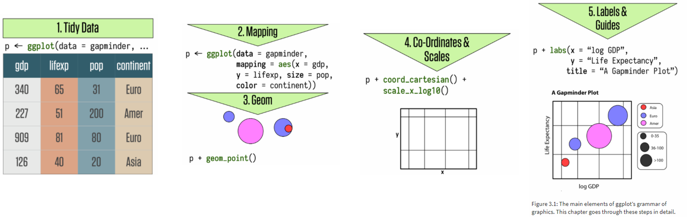

```{r setup, include=FALSE}

options(htmltools.dir.version = FALSE)
knitr::opts_chunk$set(fig.retina = 3, warning = FALSE, message = FALSE)

library(gapminder)
library(here)
library(socviz)
library(tidyverse)
 
```

# Today

- Visualization of the Week  

- Discussion of Introduction and Chapter 1 of *The Truthful Art* (Cairo)  

- Basic Charts in ggplot - Chapter 3 of *Data Visualization* (Healy)  

---
# Revisit Padlet

[Data Visualization II Padlet](https://padlet.com/jschilling_ccs/mmzv9zg2ic8e6iqs)

### What should we add?  

### What new information have we gained this week? 

---

# Discussion

“A good visualization is:  
1. reliable information,  
2. visually encoded so relevant patterns become noticeable,  
3. organized in a way that enables at least some exploration, when it’s appropriate,  
4. and presented in an attractive manner, but always remembering that honesty, clarity, and depth come first.”  

Alberto Cairo, *The Truthful Art*, p. 12


.center[
### Do you agree? Should anything be added?
]

---

# Discussion


**Candid communication:** "begin with the information and then...thoroughly analyze it to discover the messages worth spreading" (2019, Ciaro, *The Truthful Art*, p. 15)  


What do you think of the elements of journalism (p. 21)?  

--

How do these elements relate to this class?   

---

# Discussion

How do you define **data visualization** versus **infographic**?

--

What aspects of the data visualizations and infographics presented in Chapter 1 of *The Truthful Art* stood out to you?

--

**Some Interactive Examples**

[Periscope's "A World of Terror"](https://terror.periscopic.com/)  

[ProPublica's "Treatment Tracker"](https://projects.propublica.org/treatment/)  

[Wall Street Journal's "HealthCare.gov Explorer"](http://graphics.wsj.com/health-care-explorer/#/?age=30&fips=01001&metal_level=Silver)  

[The Guardian's "Beyond the Border"](https://www.theguardian.com/world/ng-interactive/2014/aug/06/-sp-texas-border-deadliest-state-undocumented-migrants)  

---

class: center, middle

# 10 Minute Break

---

# Chapter 3: Make A Plot



---

# Tidy Data

In tidy data:  
1. Each variable forms a column.  
2. Each observation forms a row.  
3. Each type of observational unit forms a table.  

From Wickham, H. (2014). Tidy Data. *Journal of Statistical Software*, 59(10).

---

# Tasks to Complete

- Reading (see Syllabus)  

- Prepare for your Visualization of the Week  

- Practice R  


