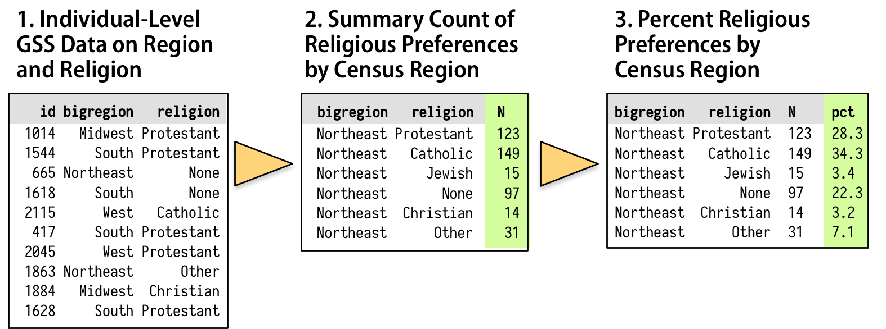

```{r setup, include=FALSE}

options(htmltools.dir.version = FALSE)

options(knitr.duplicate.label = "allow")

knitr::opts_chunk$set(fig.retina = 3, warning = FALSE, message = FALSE)

library(gapminder)
library(here)
library(socviz)
library(tidyverse)
library(countdown)
library(xaringanthemer)
library(flair)
library(flipbookr)
library(DT)
 
```

```{r xaringan-themer, include=FALSE, warning=FALSE}

style_duo_accent(
  primary_color = "#1c5253",
  secondary_color = "#c8c8c8",
  link_color = choose_dark_or_light("#FFFFFF", "#cf7270"),
  header_font_google = google_font("Josefin Sans"),
  text_font_google   = google_font("Montserrat", "300", "300i"),
  code_font_google   = google_font("Fira Mono"),
  inverse_background_color = "#1c5253",
  inverse_header_color = "#FFFFFF"
)

```

```{css change-css-options, eval = TRUE, echo = FALSE}

.remark-code{line-height: 1.5; font-size: 80%} # smaller code font size

```

# Today

- Data Visualization of the Week  

- Discussion of Chapter 3: The Truth Continuum of *The Truthful Art* (Cairo)  

- Lab on Summary statistics, grouped analysis, manipulating rows, columns and tables - Chapter 5 of *Data Visualization* (Healy)  

- Homework #2

- Midterm 

---

# Discussion - The Truth Continuum

.pull-left[

#### Axiom: Any visualization is a model  
(Cairo, 2016, p. 69)

#### Coda: The more adequately a model fits whatever it stands for without being needlessley complex, and the easier it is for is intended audience to interpret correctly, the better it will be.  
(Cairo, 2016, p. 70)

]

--

.pull-right[

- How do you define a model?

{{content}}

]


???

"A model is an abstraction that describes, explains, or predicts something about the workings of nature" (p. 86) 

--

- What does it mean for one model to be "better" than another?

{{content}}

--

- Do you agree or disagree with this axiom and coda? Why or why not?

{{content}}

--

- Why is it important to consider complexity, controls, and models in data visualization? 


---

# Discussion - The Truth Continuum


.pull-left[

#### "It's more complicated than that."

#### Good visualizations shouldn't over-simplify information. They need to clarify it. In many cases, clarifying a subject requires *increasing* the amount of information, not *reducing* it.

(Cairo, 2016, p. 78)

]

--

.pull-right[

- What does it mean to present nuance and context in data visualization? What are the implications of this on design?

{{content}}

]

--

- How does this relate to considering your audience when creating a data visualization?


???

It is important to consider the audience's prior knowledge, context, assumptions, and perspectives.


---

# Discussion - The Truth Continuum

### Mind Bugs

--

#### Patternicity

We look for and see patterns in everything, even when they are not there.

--

#### Storytelling

We like to generalize and see cause and effect, even when it's not there.

--

#### Confirmation

We look for information and interpret evidence as confirming our views, avoiding dissonance and ignoring alternate viewpoints.

--

.center[

#### What does this mean for data visualization design?

]

---

# Discussion - The Truth Continuum

- What do you think of Cairo's truth continuum? 

--

- How can we judge or evaluate the data visualizations we create on the truth continuum?

???

Judge based on rigor, effectiveness, precision, accuracy

--

- What should we aim for on the truth continuum? 

--

- What are some strategies that you will use to make truer data visualization?

???

Strategies: 
- use multiple figures
- consider the comparison (to what, to whom, to when, to where)
- take error into account (sampling error, etc.)
- increase depth
- increase breadth 
- look for other sources 

--

- Is there a conflict between simplifying and making true models/visualizations? How can a designer approach such a conflict?

---

class: center, middle

# 15 Minute Break

```{r break-countdown, echo = FALSE}
countdown(minutes = 15, seconds = 0,
          right = "37%",
          bottom = "25%",
          warn_when = 60)
```

---

.center[
```{r debug, echo = FALSE, out.width = "90%"}
knitr::include_graphics("https://github.com/allisonhorst/stats-illustrations/raw/master/other-stats-artwork/debugging.jpg")
```
]

.bottom-note[Artwork by @allison_horst]

---

## Chapter 5: Graph Tables, Add Labels, Make Notes

### The pipe operator: `%>%`



.bottom-note[
Figure 5.1 (Healy, 2019, p.95)
]

???

The pipe operator allows us to pass data from one step to another; in the diagram the yellow triangles represent the pipe operator. A pipeline of operations follows a sequence such as group, filter/select, mutate, then summarize. 

We are creating calculated fields. 

---

.center[
```{r mutate, echo = FALSE, out.width = "70%"}
knitr::include_graphics("https://github.com/allisonhorst/stats-illustrations/raw/master/rstats-artwork/dplyr_mutate.png")
```
]

.bottom-note[Artwork by @allison_horst]

???

Today we will be learning how to add columns and summarize data in our tables before we plot them using a package called dplyr and some functions. One of these functions is mutate, and it allows us to add columns to our data table.

---

# Dataset (2016 General Social Survey)

```{r new-data, echo = FALSE}
head(gss_sm) %>%
  datatable(
    extensions = 'FixedColumns',
    options = list(
      dom = 't',
      scrollX = TRUE,
      scrollCollapse = TRUE
      )) # Source: https://stackoverflow.com/questions/31085580/resize-datatables-to-fit-within-r-markdown

```

---

# Pipe Operator 

.pull-left[
```{r group, include = FALSE}
gss_sm %>%
  group_by(bigregion, religion) %>%
  summarize(N = n()) %>%
  mutate(freq = N / sum(N),
         pct = round((freq * 100), 0))
  
```

```{r decorate-group, echo = FALSE}

  decorate("group", eval = FALSE) %>%
  flair("%>%") %>% 
  knit_print.with_flair()
  
  
```
]

.pull-right[
```{r output-group, ref.label = 'group', echo = FALSE}
```
]

???

Get the proportion of each religion by region

---

```{r build-pipe, include = FALSE}

gss_sm %>%
  group_by(bigregion, religion) %>%
  summarize(N = n()) %>%
  mutate(freq = N / sum(N),
         pct = round((freq * 100), 0))

```

`r chunk_reveal(chunk_name = "build-pipe", title = "# Pipe Operator - Step by Step", widths = c(50,50))`


---

# Assignment / Equals

.pull-left[
### Before

```{r argument-example, include = FALSE, eval = FALSE}

p <- ggplot(data = gapminder,
            mapping = aes(x = year,
                          y = gdpPercap))

```

```{r decorate-example, echo = FALSE}

  decorate("argument-example", eval = FALSE) %>%
  flair("=") %>% 
  knit_print.with_flair()
  
  
```
]

--

.pull-right[
### Now

```{r group-2, ref.label = 'group', include = FALSE}

  
```

```{r decorate-group-2, echo = FALSE}

  decorate("group-2", eval = FALSE) %>%
  flair("=") %>% 
  knit_print.with_flair()
  
  
```
]


???

Notice the use of the equals sign to assign a value to a name that we choose. Before we've only seen this as a way to assign a value to a pre-named argument of a function (aes(x = year)).

---

# Creating Columns / Variables

```{r group-3, ref.label = 'group', include = FALSE}

  
```

```{r decorate-group-3, echo = FALSE}

  decorate("group-3", eval = FALSE) %>%
  flair("freq") %>% 
  knit_print.with_flair()
  
  
```


???

Notice the use of the freq column right after we made it.

---

class: center, middle, inverse

# Lab Time

### Pages 91 - 101, 110-113, 132 (bullet points 2-3), 133 (bullet points 1-3) 

???

Note na.rm option on p. 110  

110-113 section, will want to start at the bottom of 109

p. 111

by_country <- organdata %>%
  group_by(consent_law, country) %>%
  summarize_if(is.numeric, 
               list(mean = mean, sd = sd), # note funs is deprecated
               na.rm = TRUE) %>% 
  ungroup()

---

# Homework Assignment

**Task: ** Create 3 calculated fields and plot them.  

**Due: ** February 24, 2021 

[Rubric](https://bb.collegeforcreativestudies.edu/webapps/rubric/do/course/manageRubrics?dispatch=view&context=course&rubricId=_42755_1&course_id=_35307_1)

**Notes**

- You should explore a dataset other than `gapminder` (some ideas: `babynames`, `palmerpenguins`, a CSV file you found; you may also use `gss_sm` or `organdata`, but you must create something different than the book/lab)  

- To use an R package dataset that you have not used before, remember to run `install.packages("package_name")` once in the console and add `library(package_name)` to the `setup` portion of the .Rmd file

- Use your resources: Healy, Google, Student Community BUT cite where you get code from if you copy it directly  

- See Blackboard assignment for a template `.Rmd` file

---

# Midterm

**Task: ** Using R and an approved dataset, create a polished infographic that contains at least 3 charts.  

**Due: ** March 3, 2021

[Rubric](https://bb.collegeforcreativestudies.edu/webapps/rubric/do/course/manageRubrics?dispatch=view&context=course&rubricId=_42756_1&course_id=_35307_1)

- Pick a dataset using one of the resources available on Blackboard. The dataset must be approved; email Jenn a link to the dataset for approval prior to **February 24**.  

- Create summary statistics and 3-5 polished visuals based on the dataset using **only R**. 

- The visuals created in R must include: titles, axis labels, data labels and legends (as needed), your name and the data source (as footnotes/captions)  

- Output the visuals to `.svg` and import them into Adobe Illustrator to create an infographic that includes a narrative, the visuals from R, and other graphics.  

- Turn in your R code as an `.Rmd` file, including comments about what you did and why, **and** the final infographic. 
- In class on **March 3**, be prepared to share information about your dataset, your visuals, what they show, and the choices you made in their design. You will share both your code and the final infographic.

???

In class on March 3, we will be sharing critiques of each others work. If you'd like to resubmit and make changes after class on March 3, you can do so and re-submit the assignment on Blackboard. 

Presentation to the class: share your .Rmd file and be prepared to explain your data (what is it about, what does it tell you, what messages did you find in it), your visualizations (how did you create them, why did you create them, what design choices you made); share your infographic (what design choices did you make and why, what story or message does the infographic show)

---

# Tasks to Complete

- Reading (Cairo - Chapter 4: Of Conjectures and Uncertainty)  

- Homework #2

- Start Working on Midterm (dataset must be approved by **February 24**)

- Prepare for your Data Visualization of the Week  


